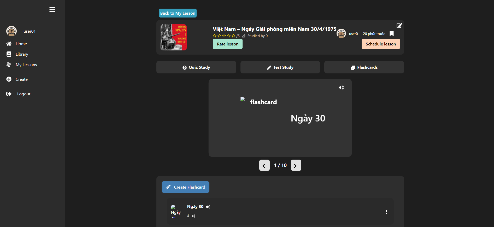

# Flashcard and Quiz Learning Platform

- **Personal Capstone Project (Jul 2025 – Sep 2025, 10 weeks)**  
  A web-based learning platform that integrates flashcards and quizzes to help students review, memorize, and test knowledge more effectively.  
  The system combines three main approaches: **learning with flashcards**, **practicing with quizzes**, and **taking tests**.

## Table of Contents
1. [Introduction & Objectives](#1-introduction--objectives)  
2. [Main Features](#2-main-features)  
3. [System Design](#3-system-design)   
4. [Technologies Used](#4-technologies-used)
5. [Illustrations](#5-illustrations) 
6. [Results](#6-results)  
7. [Limitations & Future Work](#77-limitations--future-work)

## 1. Introduction & Objectives
This project was built as an **individual capstone project**.  
Its purpose is to provide an **interactive and flexible study tool** that supports both personal learning and community engagement.

## 2. Main Features

### User Functions
- **Account Management**
  - Register, log in, log out
  - Update personal information

- **Learning and Practice**
  - Flashcards: flip cards, mark progress
  - Quiz: generate practice questions from selected flashcards
  - Test: create timed tests with customizable settings
  - Lesson Creation: manual input, upload from Excel/Word, or automatic generation (Gemini API & FastAPI HuggingFace integration)
  - Study Scheduling: Gmail reminders & notifications

- **Community Interaction**
  - Join and study lessons created by others
  - Comment and rate shared lessons
  - Search, filter, and manage lessons (CRUD operations for personal content)

### Admin Functions
- Manage user accounts (create, update, delete, approve requests)
- Moderate lessons and content shared by users
- Generate statistics and reports about user activity and lesson effectiveness

### Non-Functional Requirements
- **Usability:** Simple and intuitive user interface  
- **Compatibility:** Works on Chrome, Firefox, Edge  
- **Security:** Encrypted passwords, secure session management  

## 3. System Design
- **System Architecture**  
  
- **Project Report (Full thesis):** [View Full Report (PDF)](https://github.com/nglhongphuong/flashcard-quiz-platform/blob/main/%C4%90%E1%BB%93_%C3%81n_2025_b%E1%BA%A3n_final_01.pdf)  
  _(see Chapter 3: System Architecture Analysis & Design for more details)_

## 4. Technologies Used
- **Frontend:** ReactJS  
- **Backend:** Spring Boot, FastAPI (Gemini API integration + HuggingFace for automatic flashcard generation)  
- **Database:** MySQL (Aiven)  
- **Testing:** Postman (API testing with JSONPlaceholder)  
- **Other Services:** Gmail API for notifications  

## 5. Illustrations
Below are some screenshots of the platform:
- **Homepage (Authenticated User)**  
  

- **Homepage (Create Lesson Entry)**  
  

- **Automatic Lesson Generation**  
  

- **Manual Lesson Creation**  
  

- **View Lesson**  
  

- **Flashcard Creation Methods**  
  
  
- **More details:** See **Chapter 4 - Section 2 (Evaluation)** in the [Full Project Report](https://github.com/nglhongphuong/flashcard-quiz-platform/blob/main/%C4%90%E1%BB%93_%C3%81n_2025_b%E1%BA%A3n_final_01.pdf).

## 6. Results
- **Backend Deployment:** [API Swagger](https://flashcard-quiz-platform.onrender.com/zotri/swagger-ui/index.html)  
- **Frontend Deployment:** [Demo Website](https://zotriverse.onrender.com/)  
- **Database:** MySQL hosted on Aiven  
- **API Testing:** Postman (JSONPlaceholder) → [View API Collection](https://app.getpostman.com/join-team?invite_code=1896988308825b5f472a0ea81f8760bd4358a6cd73deca2c23a7815adc5ef95b&target_code=dcde96fbfb2901b36d80a2123632e938)  
- **AI-powered Flashcard Generation:** FastAPI + HuggingFace Space → [Demo App](https://huggingface.co/spaces/nglhongphuong/flashcard_generate)  
- **Test Report:** [Google Sheet](https://docs.google.com/spreadsheets/d/1kXi8L5MAiMwSSL7exDL4D8HUgQAzsIwN/edit?usp=sharing&ouid=112268585182906922050&rtpof=true&sd=true)  
- **Project Report Latex (Full thesis):** [View Full Report (PDF)](https://github.com/nglhongphuong/flashcard-quiz-platform/blob/main/%C4%90%E1%BB%93_%C3%81n_2025_b%E1%BA%A3n_final_01.pdf)

## 7. Limitations & Future Work
### Limitations
- Web performance not yet optimized, especially on mobile devices.  
- UI lacks consistency across different screen sizes.  
- Lesson management by categories is not supported, limiting content organization and search.  
- Dependence on free-tier services:  
  - **Render:** app sleeps after inactivity, requires 2–4 minutes to restart.  
  - **Aiven MySQL:** limited resources (1 node, low CPU/RAM/storage).  
  - **Gemini API (free plan):** limited requests per minute/day and token usage.  
- Study reminder feature is still basic (default email after 3 days, manual scheduling only).  
- Community interaction features remain limited (few channels for collaboration and sharing).  

### Future Work
- Refactor platform using **microservices architecture** for scalability and maintainability.  
- Apply **machine learning/deep learning** for more advanced automatic content generation.  
- Expand social features: real-time chat, friend system, user following.  
- Add **lesson categorization and recommendation system** for personalized study paths.  
- Support **SSO login** (Google, Facebook, Gmail) for convenience and security.  
- Enable **lesson sharing via link or QR code** for quick access.  
- Develop an **intelligent study schedule manager** for personalized and flexible learning plans.  
- Improve mobile responsiveness and provide a **dedicated mobile app** (React Native).

